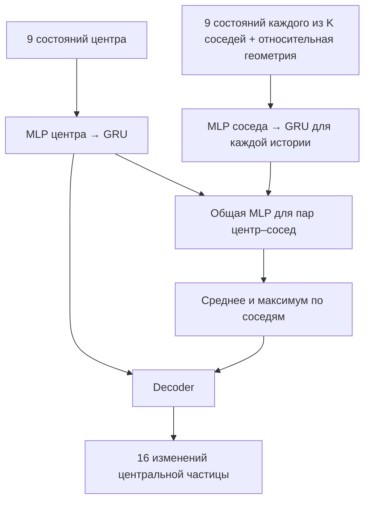

# Наша нейросеть для грунта: от физической идеи до каждой функции

Этот файл написан для человека, который понимает физику, но пока не привык
к языку ML и PyTorch. Его задача — дать возможность самому объяснить, что
происходит в программе, проверить мои решения и осознанно менять их.

Не нужно прочитать всё за один раз. Для первого прохода достаточно глав
1–6: они описывают задачу и данные. Затем главы 7–12 объясняют сеть и
обучение. Главы 13–17 связывают это с файлами. В конце — практические
команды для собственного запуска на сервере, словарь и вопросы для проверки.

**Текущая договорённость:** предсказываем каждую частицу грунта по её
состоянию, состояниям выбранных соседей и восьми предыдущим кадрам этих
же частиц. Пространственных кубов нет. Текущий кадр добавляется к восьми
предыдущим: всего на входе девять моментов времени.

## Содержание

1. [Физическая задача и роль сети](#1-физическая-задача-и-роль-сети)
2. [Что хранится в данных](#2-что-хранится-в-данных)
3. [Один учебный пример](#3-один-учебный-пример)
4. [Выбор соседей](#4-выбор-соседей)
5. [Восемь предыдущих кадров](#5-восемь-предыдущих-кадров)
6. [Входы и выходы без скрытых допущений](#6-входы-и-выходы-без-скрытых-допущений)
7. [Что такое веса и нейронная сеть](#7-что-такое-веса-и-нейронная-сеть)
8. [GRU: как читается история](#8-gru-как-читается-история)
9. [Как объединяются соседи](#9-как-объединяются-соседи)
10. [Нормализация](#10-нормализация)
11. [Ошибка, градиент и обновление весов](#11-ошибка-градиент-и-обновление-весов)
12. [Обучение и самостоятельная прокрутка](#12-обучение-и-самостоятельная-прокрутка)
13. [Карта файлов](#13-карта-файлов)
14. [Формы массивов](#14-формы-массивов)
15. [Подготовка данных по функциям](#15-подготовка-данных-по-функциям)
16. [Модель по функциям](#16-модель-по-функциям)
17. [Обучение и прокрутка по функциям](#17-обучение-и-прокрутка-по-функциям)
18. [Как понимать настройки и логи](#18-как-понимать-настройки-и-логи)
19. [Что проверено и чего мы пока не знаем](#19-что-проверено-и-чего-мы-пока-не-знаем)
20. [Самостоятельная отправка и запуск на сервере](#20-самостоятельная-отправка-и-запуск-на-сервере)
21. [Небольшие упражнения и словарь](#21-небольшие-упражнения-и-словарь)
22. [Источники для дальнейшего чтения](#22-источники-для-дальнейшего-чтения)

## 1. Физическая задача и роль сети

У нас есть численный эксперимент: плита вдавливается в грунт. Солвер
Chrono вычислил последовательность состояний частиц. Мы хотим научиться
приближённо воспроизводить переход к следующему сохранённому состоянию.

У солвера правило перехода задано уравнениями, численной схемой и
материальной моделью. У нейросети правило перехода задаётся функцией с
большим количеством настраиваемых коэффициентов — весов. Мы подбираем
эти коэффициенты по уже рассчитанным примерам.

Обозначим состояние частицы i через `s_i(t)`. В нашей записи это 16 чисел:
положение, скорость, плотность, напряжения и дополнительные колонки.
Сеть реализует приблизительно такую функцию:

```
изменение частицы i = F(
    история самой частицы i,
    истории её выбранных соседей,
    история относительного расположения соседей,
    параметры материала
)
```

Внутри этой функции нет отдельной сети «для частицы №100» и другой сети
«для частицы №101». Одна функция применяется ко всем частицам с одними
и теми же весами. Различаются входные данные, а правило обработки общее.

Это соответствует твоей идее: научить локальное правило поведения частицы.
Сеть не получает номер частицы как физический признак. Номер нужен коду,
чтобы правильно собрать её историю и найти ответ в следующем кадре.

Наличие истории и соседей ещё не гарантирует точный суррогат. Это выбор
информации, по которой мы предлагаем обучать правило. Проверка качества
должна показать, хватает ли этой информации и удаётся ли её использовать.

## 2. Что хранится в данных

Основные сведения находятся в [NN_SPEC.md](NN_SPEC.md), а загрузка — в
[surrogate/data.py](surrogate/data.py). Здесь повторены необходимые детали.

Для одного прогона есть три массива:

| Файл | Пример формы | Что хранит |
|---|---|---|
| `phi35_c1000.npy` | `(200, 46464, 16)` | Грунт во времени |
| `phi35_c1000_plate.npy` | `(200, 410, 16)` | Маркеры плиты во времени |
| `phi35_c1000_boundary.npy` | `(24855, 16)` | Один кадр неподвижных стенок |

Запись `(200, 46464, 16)` читается так: 200 кадров; в каждом 46 464
частицы; у каждой 16 чисел. Это обычная многомерная таблица, не особый
объект ML. `numpy.ndarray` — название такого массива в NumPy.

```
soil[100, 42, 9]
```

означает: взять в кадре 100 у частицы с индексом 42 колонку 9, то есть `p33`.
Индексы в Python начинаются с нуля. Поэтому кадры идут от 0 до 199.

| Колонки | Названия | Смысл |
|---|---|---|
| 0–2 | `x, y, z` | Координаты, м |
| 3–5 | `vx, vy, vz` | Скорость, м/с |
| 6 | `rho` | Плотность, кг/м³ |
| 7–9 | `p11, p22, p33` | Нормальные напряжения, Па |
| 10–12 | `shear12, shear13, shear23` | Касательные напряжения, Па |
| 13–15 | `pc, Ev, Sv` | Дополнительные колонки состояния солвера |

Порядок частиц между кадрами сохраняется: строка 42 остаётся той же
частицей, хотя её координаты меняются. Именно это позволяет собирать историю.

`pc`, `Ev`, `Sv` нужно интерпретировать по конкретной версии солвера и
выбранной реологии. В местном `phi35_c1000` все три колонки равны нулю
во всех 200 кадрах, а `rho` постоянно равно 1600. Поэтому эти три колонки
не добавляют информации о предыстории в этом прогоне. В текущей документации
Chrono MCC `Sv` обозначает specific volume, поэтому старую подпись
«сдвиговая деформация» в исходной спецификации нельзя считать проверенной.
[Описание Chrono MCC](https://api.projectchrono.org/manual_fsi_mcc_rheology.html).

Это не означает, что напряжения лишены истории или что вся физика данных
неверна. Это означает ровно то, что мы измерили: перечисленные колонки
в доступном локальном прогоне постоянны.

## 3. Один учебный пример

Возьмём целевую частицу №42 и текущий кадр 100.

1. Находим её 256 ближайших соседей в кадре 100.
2. Собираем состояния №42 в кадрах 92, 93, …, 100.
3. Для каждого выбранного соседа собираем состояния в тех же кадрах.
4. Передаём эти истории сети.
5. Получаем предсказанное изменение №42 от кадра 100 к кадру 101.
6. Вычитаем истинное состояние №42 в кадре 100 из её состояния в кадре 101.
7. Сравниваем предсказанное изменение с этим правильным изменением.

Последний пункт и даёт ошибку, по которой меняются веса.

При 50 fps между сохранёнными кадрами 1/50 = 0.02 секунды. Относительно
начала записанной последовательности кадр 100 соответствует 2.00 с,
кадр 92 — 1.84 с, следующий кадр 101 — 2.02 с.

```
Вход:    92  93  94  95  96  97  98  99  100
Ответ:                                       101
```

Кадр 101 не используется для выбора соседей, построения их историй или
входных признаков. Он нужен только для проверки ответа.

При стандартной истории первый допустимый текущий кадр — 8. Последний
в 200-кадровом прогоне — 198, потому что нужен ответ из кадра 199.
Это 191 возможный текущий момент, у каждого множество целевых частиц.

## 4. Выбор соседей

Твоя схема «взять большой радиус, при нехватке добрать, при избытке
обрезать» требует договориться о порядке добора. Мы используем расстояние:
ближайшие предпочтительнее дальних.

Если итоговое количество всегда K, эта схема эквивалентна следующей:

```
Найти K ближайших других частиц во всём текущем кадре.
```

Поэтому основной параметр — `neighbors=256`. Радиус получается как
расстояние до последнего выбранного соседа. В более плотном окружении он
меньше, у свободной поверхности или вылетевшей частицы — больше.

Метод поиска называется KNN, k-nearest neighbours. Здесь KNN только
выбирает данные. Он сам не является обучаемой частью модели и не
предсказывает напряжения. Для быстрого поиска используется пространственная
структура `cKDTree`. [Документация поиска](https://docs.scipy.org/doc/scipy/reference/generated/scipy.spatial.cKDTree.query.html).

На `phi35_c1000` измерены 12 288 случайных целевых частиц на шести кадрах:

| Радиус | p5 соседей | Медиана | p95 соседей | Среднее |
|---|---:|---:|---:|---:|
| 6 см | 88 | 108 | 114 | 105.8 |
| 8 см | 196 | 254 | 263 | 248.7 |
| 10 см | 359 | 501 | 511 | 484.2 |

`p5` — значение, ниже которого лежат 5% наблюдений, `p95` — 95%.
Поэтому между p5 и p95 находится примерно 90% наблюдений. Медиана
делит наблюдения пополам, а среднее — обычная сумма, делённая на число.

Для K = 256 медианный радиус составил около 8.0 см, p95 — 8.5 см,
максимум в этой выборке — 13.2 см. Для K = 512 p95 был около 11.0 см.
Это измерения одного прогона, не доказательство оптимальности K.

В окружение включаются грунт, плита и стенки. Сама целевая частица
исключается по её ID. Две разные частицы в одной геометрической точке
остаются разными частицами, и расстояние ноль не повод удалить обе.

Если во всём кадре меньше K других маркеров, мы не копируем одних и тех
же соседей несколько раз. Дополняем массив пустыми местами и отдельно
помечаем их маской. На реальном полном кадре частиц намного больше 256.

Поиск по числу рёбер в графе пока не реализован. Это другая метрика
расстояния: сколько переходов по связям нужно сделать, а не сколько метров
между точками. Её можно исследовать отдельно, как ты и предложил.

## 5. Восемь предыдущих кадров

`history_frames=8` означает **восемь предыдущих плюс текущий**, итого H = 9.
Охват назад при стандартных настройках — 8 × 0.02 = 0.16 с.

Соседей выбираем один раз в текущем кадре. Затем следим назад за теми же
ID. Допустим, сейчас соседями №42 оказались №17, №81 и №305.

| Последовательность | Кадр 92 | Кадр 93 | … | Кадр 100 |
|---|---|---|---|---|
| Центр | №42 | №42 | … | №42 |
| Первый выбранный сосед | №17 | №17 | … | №17 |
| Второй выбранный сосед | №81 | №81 | … | №81 |

Сосед №17 мог в кадре 92 находиться далеко. Всё равно берём его
собственную историю. Если каждый раз брать «первого ближайшего» заново,
можно склеить историю разных частиц, что не соответствует поставленной задаче.

Помимо состояний, для каждого соседа сохраняем относительное положение
и относительную скорость к центру в каждый момент. Сеть получает информацию
не только о напряжениях соседа, но и о том, приближался он или удалялся.

Такой выбор хранит истории **нынешних** соседей. Частица, которая
воздействовала на центр раньше, но сейчас вышла из списка K, отдельно
не попадёт во вход. Её воздействие может быть отражено в истории центра,
но мы не утверждаем, что это обязательно исчерпывающая информация.

`frame_stride=1` означает брать соседние сохранённые кадры. Если поставить
`frame_stride=2`, шаг прогноза станет 0.04 с, история также будет идти
через кадр и охватит 0.32 с назад. Это уже другой эксперимент. Пока
оставляем stride равным 1.

## 6. Входы и выходы без скрытых допущений

Для центра на каждом историческом кадре собираются 18 признаков:

```
3 скорости + 10 колонок состояния + 3 признака типа + 2 параметра материала
```

Тип кодируется тремя индикаторами, one-hot: грунт `[1,0,0]`, стенка
`[0,1,0]`, плита `[0,0,1]`. Это помогает сети различать материал и границы.
Два параметра материала — угол внутреннего трения и сцепление.

Сосед получает те же 18 признаков и ещё 7 относительных признаков:

```
dx, dy, dz, расстояние, dvx, dvy, dvz
```

Здесь `dx = x_соседа - x_центра`, аналогично для остальных компонент.
Координаты используются при поиске соседей и вычислении относительных
векторов. Абсолютная координата вроде «x = 0.317 м» отдельным входом не
подаётся. Это выбранное устройство признаков, а не утверждение, что
положение в физике не имеет значения.

Для граничных маркеров используем их движение и тип, но 10 материальных
колонок заменяем нулями во всех исторических кадрах. Напряжения BCE-маркеров
в данных меняются вслед за откликом грунта; они не являются заранее
известным законом движения плиты. Подавать их истинные значения при
самостоятельной прокрутке означало бы получать подсказку от солвера.

На выходе 16 **изменений** исходных величин:

```
delta = состояние_в_следующем_кадре - состояние_сейчас
```

Например, `z` изменилось с 0.2000 м до 0.1999 м. Целевое `delta_z`
равно −0.0001 м. Для `p33` переход с −20 000 Па к −20 500 Па даёт
целевое изменение −500 Па. При прогнозе прибавляем изменения к текущему
состоянию. Все 16 столбцов восстанавливаются таким образом.

В новой версии скорость берётся из текущих данных, а дальше предсказывается
самой сетью. В прежней GNS скорость вычислялась из двух положений, выходом
было ускорение, а положение интегрировалось по Верле. Это разные конструкции.

Почему изменения? Иначе большой масштаб абсолютного состояния позволяет
получить впечатляющую абсолютную точность, просто почти повторяя вход.
Изменения и их нормализация помогают направить обучение на переход во
времени. Но даже с ними нужен baseline «ничего не изменилось».

Само по себе предсказание координат и скорости двумя группами выходов не
гарантирует их кинематическую согласованность. В первой версии это
обучается по данным; отдельного физического ограничения пока нет.

## 7. Что такое веса и нейронная сеть

Начнём с привычной аппроксимации. Допустим, мы подбираем по измерениям
зависимость `y = a*x + b`. Коэффициенты a и b неизвестны. Подобрать их
так, чтобы уменьшить ошибку на наблюдениях, — уже пример обучения модели.

У нейронной сети тоже есть коэффициенты. Один линейный слой вычисляет
несколько выражений вида:

```
u = w1*x1 + w2*x2 + ... + wn*xn + b
```

`x1...xn` — входные признаки. `w1...wn` и `b` — обучаемые веса и смещение.
Когда таких выражений много, их удобно записывать матрично: `u = W*x + b`.

Один линейный слой способен выразить только линейную зависимость. Между
слоями добавляют нелинейную функцию. У нас используется ReLU:

```
ReLU(u) = max(0, u)
```

Комбинация линейных преобразований и нелинейностей может описывать
существенно более сложные зависимости. Сами коэффициенты при этом не
становятся известными физическими константами вроде модуля Юнга.

MLP — multilayer perceptron, обычная многослойная сеть. В нашем проекте
функция `mlp()` из [surrogate/model.py](surrogate/model.py) собирает:

```
Linear → ReLU → Linear → ReLU → Linear → необязательный LayerNorm
```

`hidden=128` задаёт размер промежуточного представления: 128 чисел.
Это не 128 частиц, соседей, кадров или физических уравнений.

Промежуточное представление называют embedding или скрытым вектором.
Его координаты подбираются обучением. Для понимания устройства сети
достаточно знать, какие данные в него поступают и где он применяется;
приписывать каждому скрытому числу физический смысл не нужно.

`LayerNorm` помогает управлять масштабом скрытого представления внутри
сети. Это другая операция, чем нормализация физических колонок датасета,
которая разбирается в главе 10.

## 8. GRU: как читается история

GRU — recurrent unit, блок для последовательностей. В нашем коде он
читает кадры от самого старого к текущему. На очередном кадре у него есть
два источника информации: признаки этого кадра и скрытый вектор, оставшийся
после чтения предыдущего.

Упрощённая картина обновления:

```
новый скрытый вектор = z * старый + (1-z) * кандидат
```

Коэффициент z вычисляется самой сетью и различается для разных компонент.
Он регулирует, сколько старого представления сохранить. Есть также reset
gate, участвующий в вычислении кандидата. Это обучаемые числовые операции,
а не заранее прописанные правила «запомнить пластическую деформацию».
Точные формулы приведены в [документации PyTorch GRU](https://docs.pytorch.org/docs/stable/generated/torch.nn.GRU.html).

В физическом языке можно представить последовательность наблюдений за
нагружением: не только текущее напряжение, но и то, как оно росло и как
менялась скорость. GRU получает возможность использовать этот путь.
Какие закономерности она действительно выучит, установит эксперимент.

Как это устроено у нас:

1. `center_encoder` преобразует 18 признаков каждого кадра центра в 128 чисел.
2. GRU читает его 9 полученных векторов. Последний скрытый вектор
   представляет историю центра для дальнейшего расчёта.
3. `neighbor_encoder` преобразует 25 признаков каждого кадра соседа:
   18 собственных и 7 относительных к центру.
4. Та же GRU читает последовательность каждого соседа отдельно.

**Общие веса GRU не означают общую память всех частиц.** У каждого
примера и каждого соседа своё скрытое состояние. Общими являются
коэффициенты правила, по которому это состояние обновляется.

При новом окне скрытое состояние начинается заново. Мы не храним
неограниченную память от начала всего эксперимента. Сеть видит переданные
ей девять кадров. В прокрутке каждый раз формируется новое скользящее окно.

Почему GRU? Это выбранный первый способ обработать историю по порядку.
Он не требует превращать девять кадров в один неструктурированный список.
Мы ещё не показали, что GRU лучше MLP с объединёнными кадрами, LSTM или
другой временной модели на этих данных. Выбор метода и доказательство
его полезности — разные этапы.

## 9. Как объединяются соседи

После чтения истории есть один вектор центра и K векторов соседей.
Для каждого соседа функция `message` получает:

```
[представление истории центра, представление истории этого соседа]
```

Она выдаёт 128 чисел — обучаемое описание пары. Слово message здесь
не означает сообщение между программами. Это просто имя вектора внутри сети.

Затем по K векторам считаются два результата:

- среднее значение каждой из 128 компонент;
- максимальное значение каждой из 128 компонент.

Это pooling, объединение набора. Максимум здесь берётся по **скрытым
признакам**, а не напрямую по физическому давлению. Сеть сначала учится
преобразованию информации о соседях, и лишь затем мы объединяем результаты.

Среднее и максимум не зависят от порядка элементов. Если переставить
соседей вместе с их историями, итоговый прогноз останется тем же с точностью
до вычислительного округления. Соседи образуют множество, а временные
кадры — упорядоченную последовательность. Это два разных требования.

Такой способ обработки множества связан с подходом
[Deep Sets](https://proceedings.neurips.cc/paper/2017/hash/f22e4747da1aa27e363d86d40ff442fe-Abstract.html).
Мы используем конкретный вариант со средним и максимумом, без утверждения,
что он оптимален для нашей физики.

Наконец, decoder получает три вектора: центр, среднее соседей, максимум
соседей. При hidden=128 вместе это 384 числа. Из них decoder выдаёт
16 нормализованных изменений состояния центральной частицы.



В этой модели сосед не собирает дополнительных соседей для своей истории.
Нет шести раундов распространения по графу, как в прежней GNS. Есть
выбранное непосредственное окружение центра и история каждого его участника.

## 10. Нормализация

У разных величин разные масштабы. Изменение координаты может быть порядка
0.0001 м, а изменение напряжения — сотни паскалей. Если просто сложить
квадраты ошибок в исходных единицах, масштаб напряжений может подавить
вклад координат независимо от их практической важности.

Для каждой входной и выходной колонки отдельно оцениваем среднее μ и
стандартное отклонение σ по выбранным обучающим примерам:

```
нормализованное значение = (исходное значение - μ) / σ
```

Это переносит разные столбцы на более сопоставимые численные масштабы.
«Ошибка 1» после такой операции означает ошибку порядка одного обучающего
стандартного отклонения соответствующего признака, а не один паскаль или метр.

Нормализация считается отдельно для состояния узла, относительных признаков
связи и целевых изменений. Одни и те же статистики состояния используются
для центра и соседей. Исторические кадры входят в оценку входных статистик.

Если колонка оказалась постоянной, её σ равно нулю. Делить на ноль нельзя,
поэтому код использует масштаб 1. Это техническое правило деления;
оно не означает, что у постоянной физической величины появилась дисперсия.

Средние и масштабы оцениваются только на обучающих прогонах, затем
сохраняются с моделью. Для проверки и прокрутки берутся те же числа.
Пересчитывать статистики по будущей тестовой траектории было бы подсказкой.

По умолчанию статистики оцениваются по `stats_frames=40` случайным
обучающим пакетам. Это выборочная оценка, а не полный проход всех частиц
и моментов. Её достаточность тоже имеет смысл проверять экспериментально.

Обратное преобразование при прогнозе:

```
delta_в_физических_единицах = delta_нормализованная * σ + μ
новое_состояние = текущее_состояние + delta_в_физических_единицах
```

Нормализация не делает предсказание физически правильным сама по себе.
Она задаёт удобные масштабы входов и фактический баланс ошибок между выходами.

## 11. Ошибка, градиент и обновление весов

### Сначала одна величина

Пусть правильное нормализованное изменение равно 0.4, а сеть выдала 0.1.
Квадрат ошибки равен `(0.1 - 0.4)^2 = 0.09`.
Если вместо этого сеть выдаст 0.3, квадрат ошибки будет 0.01.
Нам нужно менять веса так, чтобы типичная ошибка становилась меньше.

### Затем все выходы и частицы пакета

У одной частицы 16 выходов. У пакета B целевых частиц. MSE — mean squared
error, средний квадрат ошибки — считается по всем этим B × 16 числам:

```
loss = среднее((предсказанные_изменения - правильные_изменения)^2)
```

Это одно число, по которому выполняется обновление. Каждая нормализованная
колонка имеет одинаковый коэффициент в сумме. Группа из шести напряжений
содержит шесть слагаемых, а одна плотность — одно. Отдельных физически
подобранных весов групп в первой версии нет.

### Что такое градиент

Градиент показывает, как изменится ошибка при небольшом изменении веса.
Можно представить подбор одного коэффициента a в `y = a*x`: если
увеличение a повышает ошибку, хотим двигать a в другую сторону.

У сети весов много, и каждый влияет на конечный ответ через цепочку
вычислений. Обратное распространение, backpropagation, применяет правило
дифференцирования сложной функции по этой цепочке. PyTorch вычисляет
производные автоматически для записанных операций над тензорами.

В коде ключевые действия такие:

```python
loss = ((predict(model, batch) - batch["y"]) ** 2).mean()
optimizer.zero_grad(set_to_none=True)
loss.backward()
torch.nn.utils.clip_grad_norm_(model.parameters(), 1.0, error_if_nonfinite=True)
optimizer.step()
```

Их смысл по порядку:

1. Получить прогноз и число ошибки.
2. Очистить градиенты от прошлого обновления.
3. Вычислить производные ошибки по весам.
4. Ограничить суммарную норму слишком большого градиента.
5. Изменить веса с помощью оптимизатора.

`backward()` сам веса не меняет. `step()` сам не знает правильный ответ:
он использует вычисленные градиенты и собственное состояние.

### Adam и learning rate

У нас оптимизатор Adam. Он ведёт сглаженные оценки градиентов и их
квадратов, чтобы масштабировать обновления разных параметров. На первом
проходе достаточно понимать: это выбранный алгоритм изменения весов
по наблюдаемым ошибкам, а не ещё одна физическая модель.

`lr=1e-4` — начальный learning rate, масштаб обновлений. Слишком большой
шаг может мешать сходиться, слишком маленький — сильно замедлять обучение.
В этом проекте scheduler постепенно уменьшает его:

```
lr(step) = начальный_lr * 0.1 ** (step / lr_decay_steps)
```

При `lr_decay_steps=50000` за 50 000 обновлений learning rate уменьшается
в десять раз. За 20 000 — не в десять раз, а примерно до 0.398 исходного.
Эта формула непосредственно записана в нашем `train.py`.

### Почему ошибка скачет между пакетами

Соседний шаг обучения может взять другой материал, другое время и другие
частицы. Спокойный участок и зона активного выдавливания дают разные
ошибки. Поэтому loss не обязан уменьшаться после каждого обновления.

Судить о прогрессе лучше по фиксированным проверочным примерам и
последовательным проверкам прокрутки, а не по одному случайному пакету.

### Какие числа не обучаются

K, длина истории, размер пакета, hidden, learning rate — выбранные
настройки, гиперпараметры. Сеть в текущем коде не изменяет их автоматически.
Выбор соседей через cKDTree тоже не дифференцируется.

Обучаются матрицы и смещения MLP, GRU и параметры LayerNorm. Их значения
сохраняются в checkpoint. Следующая подача новых входных данных использует
эти же коэффициенты, пока мы не выполним новое обновление обучения.

## 12. Обучение и самостоятельная прокрутка

### Обучение одному переходу

В обучающем примере история грунта взята из правильных данных солвера.
Сеть предсказывает один следующий переход, сравнивается с ответом, после
чего следующий пакет может прийти из совсем другого прогона и времени.

Первая версия не обучается через цепочку из 200 собственных прогнозов.
Девять входных кадров означают историю наблюдений, а не девять шагов
авторегрессионного обучения. Это отдельные понятия.

### Прокрутка, или rollout

Для запуска нужны первые девять кадров, от 0 до 8. Это начальная история.
Дальше:

```
[истинные 0 ... 8]       → предсказание 9
[истинные 1 ... 8, 9̂]   → предсказание 10
[истинные 2 ... 8, 9̂,10̂] → предсказание 11
...
```

Шапочка здесь обозначает предсказанный кадр. Когда окно продвинется
достаточно далеко, оно будет полностью состоять из собственных прогнозов.
Новый правильный грунт из солвера внутрь окна не подставляется.

При 200 кадрах и восьми предыдущих в начальном окне остаётся 191
самостоятельный переход: от кадра 8 к 9, затем до кадра 199.

### Все частицы обновляются из одного состояния

Мы можем обработать первые 32 частицы, затем следующие 32 и так далее.
Но каждая читает одну и ту же текущую историю. Результаты пишутся в
отдельный следующий кадр. Только после окончания всех пакетов история
сдвигается вперёд.

Если бы №101 видела уже обновлённую №100, а №100 видела старую №101,
ответ зависел бы от порядка обхода. Такого обновления в нашей реализации нет.

### Откуда берётся движение плиты

В данном опыте оно задано. При прокрутке используем известные координаты
и скорости граничных маркеров из соответствующих записей. Их напряжения
не используем. При применении к новому опыту нужно предоставить такой же
известный закон движения границы.

Здесь мы не обучаем совместную динамику свободной плиты, движение которой
должно определяться реакцией грунта. Это была бы более широкая задача.

### Почему появляется накопление ошибки

Небольшое смещение или ошибка напряжения меняет вход следующего шага.
Следующий прогноз может ошибиться сильнее, а потом ошибка снова вернётся
на вход. Поэтому хороший одношаговый MSE не доказывает устойчивой траектории.

История даёт больше информации, но не отменяет этот эффект. В первой
версии нет специального обучения на собственных ошибочных историях,
дополнительного шума или штрафа по многошаговой траектории. Это возможные
дальнейшие эксперименты, а не уже реализованные свойства.

### Что считать качеством

Полезно смотреть на несколько вещей отдельно:

- одношаговую ошибку каждой физической величины;
- сравнение с «состояние частицы не изменяется»;
- рост ошибки координат во времени;
- ошибки напряжений и поведения под плитой;
- кривую давления и сравнение на разных материалах;
- время расчёта с учётом поиска соседей и подготовки историй.

Меньшая ошибка и больший выигрыш скорости не обязаны улучшаться вместе.
Больше соседей и больше истории означают больше вычислений.

## 13. Карта файлов

Новый режим находится в `surrogate/particle/`. Старые `surrogate/train.py`
и `surrogate/model.py` относятся к прежней GNS. Новая модель использует
из старых файлов только отдельные общие функции, а не старую архитектуру.

| Файл | Ответственность | Когда читать |
|---|---|---|
| [surrogate/data.py](surrogate/data.py) | Загрузка исходных массивов, ID типов, параметры прогона | Сначала |
| [surrogate/particle/config.py](surrogate/particle/config.py) | Настройки новой версии | Сначала |
| [surrogate/particle/neighbors.py](surrogate/particle/neighbors.py) | Поиск K соседей без кубов | После понимания одного примера |
| [surrogate/particle/data.py](surrogate/particle/data.py) | Истории, входы, ответы, нормализация | Затем |
| [surrogate/particle/model.py](surrogate/particle/model.py) | MLP, GRU и объединение соседей | После данных |
| [surrogate/particle/train.py](surrogate/particle/train.py) | Цикл обучения, проверка, сохранение | После модели |
| [surrogate/particle/rollout.py](surrogate/particle/rollout.py) | Последовательный прогноз всего грунта | Последним из основных |
| [scripts/particle_neighbors.py](scripts/particle_neighbors.py) | Измерение соседства на настоящих данных | Для выбора K |
| [tests/test_particle.py](tests/test_particle.py) | Проверки свойств кода | Для понимания гарантий |

Ниже разбор функций. Не нужно одновременно помнить весь файл. Сначала
найди вход конкретной функции, затем возвращаемый результат, и только
потом читай промежуточные операции.

## 14. Формы массивов

Четыре обозначения достаточно держать перед глазами:

| Обозначение | Что означает | По умолчанию |
|---|---|---:|
| B | Целевых частиц в пакете | 32 |
| K | Соседей каждого центра | 256 |
| H | Моментов в истории вместе с текущим | 9 |
| D | Размер скрытого представления | 128 |

После `build_inputs()` и `to_tensors()`:

| Ключ | Форма | Как прочитать |
|---|---|---|
| `x` | `(B,H,18)` | Истории B центральных частиц |
| `neighbors` | `(B,K,H,18)` | K отдельных историй на каждый центр |
| `e` | `(B,K,H,7)` | Относительные признаки в каждый исторический момент |
| `valid` | `(B,K)` | Какие места действительно заняты соседями |
| `y` | `(B,16)` | Правильные изменения центров на следующий шаг |

При стандартных параметрах `neighbors.shape = (32,256,9,18)`.
Элемент `neighbors[3,10,0,0]` — первая входная колонка, то есть `vx`,
у одиннадцатого соседа четвёртого центра в самом старом кадре окна.

Внутри сети:

```
центр:       (B,H,18)     → MLP → (B,H,D)     → GRU → (B,D)
соседи:      (B,K,H,25)   → временно (B*K,H,25)
             → MLP → (B*K,H,D) → GRU → (B*K,D) → (B,K,D)
пары:        (B,K,2*D)    → message → (B,K,D)
объединение: среднее (B,D), максимум (B,D)
decoder:     (B,3*D)      → (B,16)
```

Операция `reshape` меняет способ организации осей без изменения смысла
отдельных последовательностей. Мы временно считаем B×K историй соседей
большим пакетом для общей GRU. Она не перемешивает кадры разных частиц.

`transpose` меняет порядок осей. `concatenate` в NumPy и `torch.cat`
в PyTorch соединяют массивы вдоль выбранной оси. `axis=-1` или `dim=-1`
означает последнюю ось — здесь обычно ось признаков.

Тензор PyTorch похож на массив NumPy, но может жить на GPU и участвовать
в автоматическом дифференцировании. Преобразование в тензор само по себе
не является обучением.

## 15. Подготовка данных по функциям

### `Run` в `surrogate/data.py`

`Run(data_dir, tag)` описывает один прогон. `parse_tag()` извлекает
параметры из имени: для `phi35_c1000` это 35 и 1000.

Свойства `soil`, `plate`, `boundary` открывают `.npy` через memory mapping.
Можно думать об этом как о доступе к большому массиву на диске без
обязательной загрузки сразу всех его кадров в оперативную память.

`frame(t)` собирает нужный кадр в порядке **грунт, плита, стенки**.
Стены добавляются из одного неподвижного кадра. `types` формирует
соответствующие метки. Числовые коды типов и порядок групп — разные вещи:
коды SOIL=0, WALL=1, PLATE=2, а группы в массиве идут soil, plate, wall.

`discover_runs()` находит теги с полным набором трёх файлов.
`reference` и `solver_wall_seconds()` нужны уже для оценки давления и скорости.

### `Config` в `particle/config.py`

Объект с именованными параметрами. `cfg.neighbors` означает обратиться
к полю neighbors. `__post_init__()` проверяет базовую допустимость значений.
`holdout_tags` разбивает строку с тегами. `to_dict()` и `from_dict()`
переводят настройки в словарь и обратно для сохранения и загрузки.

### `nearest_neighbors()` в `particle/neighbors.py`

Входы: положения всех маркеров текущего кадра, ID центров и желаемое K.
Выходы: таблица ID соседей `(B,K)` и маска valid той же формы.

Поиск запрашивает до K+1 ближайших, потому что в выдачу обычно попадёт
сам центр. Затем именно его ID исключается. Остальные сохраняются
в порядке расстояния. Нет случайной пространственной коробки и нет
поиска соседей только среди целевых частиц пакета.

### `input_features()` в `particle/data.py`

Берёт один кадр и собирает 18 признаков каждой частицы. Материальное
состояние плиты и стенок обнуляет в копии; исходные данные не переписывает.
Скорости граничных маркеров сохраняются.

### `build_inputs()`

Получает историю `(H,N,16)` всего кадра, где N — все маркеры.
По последнему кадру выбирает соседей. Затем по полученным ID собирает
все H состояний каждого соседа, вычисляет относительные признаки и
возвращает `x`, `neighbors`, `e`, `valid`.

Пример с соседом №17: индекс 17 используется на всей временной оси,
независимо от того, кто был ближайшим на старых кадрах. Это важное
свойство проверяется отдельным тестом.

Если дерево соседей и входные признаки уже подготовлены, функция умеет
использовать их повторно. Это экономит расчёт при прогнозе всего кадра
пакетами. Состав доступного окружения от этого не меняется.

### `ParticleDataset.__init__()`

Готовит список допустимых пар `(номер прогона, текущий кадр)`.
Моменты с недостаточной историей или без следующего кадра не включаются.
Создаёт генератор случайной выборки с заданным seed.

### `ParticleDataset.sample()`

Выбирает случайный текущий момент из списка и B разных целевых частиц
грунта в этом кадре. Затем вызывает `build()`.

Выборка сейчас равномерная по целевым частицам, специального усиления
зоны под плитой нет. Это простой исходный вариант. Он не гарантирует,
что за 20 000 обновлений будет использована каждая возможная пара
«частица, время»; примеры могут повторяться.

### `ParticleDataset.build()`

Загружает историю от `t - history_frames * frame_stride` до t включительно.
Передаёт её в `build_inputs()`. Затем берёт будущие 16 величин **тех же
центров** и вычитает текущие. Добавляет полученную таблицу в `y`.

Соседям не назначается отдельный ответ в этом примере. Они служат входом
для центра. Та же частица может стать центром в другом примере.

### `_Moments` и `Stats.compute()`

`_Moments` накапливает число наблюдений, среднее и сумму квадратов
отклонений небольшими порциями. Так не нужно держать все обучающие
окружения в памяти одновременно. `Stats.compute()` ведёт такие
накопители для узлов, относительных признаков и целевых изменений.

`Stats.norm()` нормализует значения, `Stats.denorm()` возвращает единицы.
`to_dict()` делает статистики пригодными для записи в checkpoint.

### `to_tensors()`

Нормализует числовые массивы, снова обнуляет заполнители отсутствующих
соседей и создаёт тензоры. На этом этапе данные ещё могут находиться
на CPU; перенос на выбранное устройство выполняет цикл обучения.

## 16. Модель по функциям

### `ParticleNet.__init__()`

Создаёт обучаемые блоки:

| Поле | Вход на одном элементе | Результат | Назначение |
|---|---|---|---|
| `center_encoder` | 18 признаков кадра | D чисел | Подготовить кадр центра |
| `neighbor_encoder` | 25 признаков кадра | D чисел | Подготовить кадр соседа с геометрией |
| `history` | H векторов по D | Последнее скрытое состояние D | Прочитать последовательность через GRU |
| `message` | История центра D + история соседа D | D чисел | Описать пару |
| `decoder` | Центр D + среднее D + максимум D | 16 чисел | Получить изменения центра |

Последний линейный слой decoder начинается с нулевых весов и смещений.
До обучения нормализованный прогноз равен нулю; после обратной
нормализации это среднее изменение обучающей выборки. Это **не обязательно
нулевое изменение в физических единицах**.

Почему обнуляем только последний слой? Это позволяет начать с простого
предсказания и не вносить случайный дрейф во все физические колонки.
Остальные слои имеют обычную инициализацию. Это ещё одно инженерное
решение, а не физический закон.

### `encode_history(sequence, encoder)`

Сначала применяет указанный encoder ко всем кадрам последовательности.
Затем GRU читает полученные векторы. Из её ответа забирается последнее
скрытое состояние. `last_hidden[-1]` здесь выбирает единственный слой GRU,
а не последнюю частицу из пакета.

### `forward(x, neighbors, e, valid)`

Это прямой проход, вычисление ответа по данным и текущим весам:

1. Закодировать историю каждого центра.
2. Соединить признаки и геометрию соседей по оси признаков.
3. Прочитать B×K отдельных историй соседей через GRU.
4. Соединить каждый результат с историей соответствующего центра.
5. Вычислить K векторов пар общей функцией message.
6. Исключить пустые места маской, посчитать среднее и максимум.
7. Передать объединённое представление в decoder.

Возвращается `(B,16)`. Здесь нет вызова оптимизатора, чтения будущего
кадра или изменения позиций частиц на диске.

### `predict(model, batch)`

Короткая вспомогательная функция: извлекает из словаря нужные четыре
входа и вызывает модель. `batch['y']` ей не передаётся.

## 17. Обучение и прокрутка по функциям

### `split_runs()` в `particle/train.py`

Делит целые прогоны по тегам на обучающие и отложенные. Пример: сеть
видит много сочетаний параметров грунта, но не видит `phi30_c500` при
обновлении весов. Затем проверяется на нём.

Это сильнее проверки на соседнем кадре уже знакомого прогона. Случайное
перемешивание всех частиц всех кадров перед разделением дало бы слишком
похожие обучающие и проверочные примеры, особенно при перекрывающихся историях.

По умолчанию отложены четыре тега:

```
phi30_c500, phi40_c2000, phi25_c5000, phi45_c0
```

Если нужных файлов нет, программа сообщает об этом и останавливается.
Только явный `--holdout ''` разрешает диагностировать по обучающим данным.
Он не превращает такую проверку в независимую валидацию.

### `main()` в `particle/train.py`: подготовка

`argparse` читает параметры командной строки. Например, `--neighbors 512`
задаёт K=512. При обычном запуске остальные значения берутся из Config.
При `--resume` основой становятся настройки сохранённого checkpoint.

Дальше программа:

1. Находит прогоны и отделяет holdout.
2. Выбирает устройство: CUDA, MPS или CPU при `--device auto`.
3. Создаёт обучающую выборку и вычисляет статистики либо загружает их.
4. Создаёт фиксированный набор проверочных примеров.
5. Создаёт сеть, Adam и scheduler.
6. При продолжении загружает веса и состояния обучения.
7. Запускает цикл обновлений.

Нормализация сохраняется в `stats.npz` и внутри checkpoint. При новом
эксперименте она вычисляется заново; случайный старый `stats.npz` из
чужого режима не подхватывается как подходящий автоматически.

### `main()`: повторяющийся цикл

Каждый шаг получает новый пакет центров и их историй, вычисляет loss,
градиенты и одно обновление Adam. `steps=20000` — 20 тысяч обновлений,
а не 20 тысяч секунд физического времени.

При B=32 через 20 тысяч обновлений пройдёт до 640 тысяч выбранных
примеров. Они могут повторяться. Это не означает, что просмотрены все
возможные точки во всех 25 прогонах.

Лог печатается раз в `log_every` обновлений. Проверка фиксированных
примеров выполняется раз в `val_every` и на последнем шаге.

### `evaluate()`

Выключает построение градиентов, получает прогнозы на фиксированных
примерах и считает ошибки. Веса не изменяет. Возвращает:

- `mse`: средний квадрат ошибки по 16 нормализованным выходам;
- `feature_mse`: то же отдельно для каждой колонки;
- `feature_rmse`: корень из ошибки в исходных физических единицах;
- `zero_delta_mse`: ошибка правила «состояние не меняется»;
- `particles`: сколько целевых частиц проверено.

Проверка использует правильные истории. Это по-прежнему одношаговая
валидация, а не самостоятельная длинная траектория.

### `save()` и `load_checkpoint()`

Checkpoint — сохранение состояния эксперимента, файл `.pt`.
В нём находятся:

| Ключ | Что сохраняет |
|---|---|
| `kind` | Версию архитектуры: `particle-history-delta-v2` |
| `config` | Настройки |
| `stats` | Нормализацию |
| `model` | Обучаемые параметры сети |
| `optimizer` | Состояние Adam |
| `scheduler` | Состояние изменения learning rate |
| `step` | Выполненное число обновлений |
| `best_val` | Лучшую одношаговую проверочную ошибку |
| `data_rng`, `torch_rng` | Состояния генераторов для продолжения |
| `train_tags`, `val_tags` | Какие прогоны участвовали в разделении |

`model.pt` содержит последнее сохранённое состояние. `best.pt` — состояние
с лучшим **одношаговым** holdout-MSE. Это не гарантирует лучшую длинную
прокрутку. При отсутствии holdout `best.pt` не выбирается.

Старый `checkpoints/gns/best.pt` не подходит для новой архитектуры. Ранняя
техническая версия без истории тоже несовместима. Проверка `kind`
предотвращает случайную загрузку таких весов как будто это та же сеть.

`--resume` восстанавливает настройки, веса, нормализацию и оптимизатор
вместе. Существенные параметры вроде K и длины истории при продолжении
менять нельзя: для их сравнения создаётся новый эксперимент.
Одинаковое случайное состояние помогает воспроизводимости, но не обещает
побитового совпадения на разных устройствах и версиях библиотек.

### `predict_next_frame()` в `particle/rollout.py`

Получает историю и известное следующее движение границ. Строит дерево
соседей по последнему кадру. Затем обрабатывает все частицы грунта
пакетами и заполняет отдельный следующий кадр.

У этой функции нет параметра «истинный следующий грунт». Ей передаются
только известные шесть колонок границ: координаты и скорости. Поэтому
истинные будущие напряжения не нужны для вычисления прогноза.

### `rollout()`

Загружает начальную историю, вызывает `predict_next_frame()`, удаляет
самый старый кадр и добавляет предсказанный. После получения прогноза
считает метрики по настоящему грунту. Повторяет до нужного времени.

Возвращает ошибки по времени и по физическим колонкам, оценки давления
и время расчёта. Полные массивы всех предсказанных частиц в `.npz`
этого режима пока не сохраняются. Его файл результата содержит диагностику.

Оценка давления переиспользует `plate_pressure()` прежней версии:
минус среднее `p33` в тонком слое под плитой. Это приближение уже имеет
собственную ошибку на данных солвера. Ошибка этой формулы и ошибка
предсказанных напряжений — разные источники расхождения.

### `scripts/particle_neighbors.py`

Измеряет для нескольких кадров число соседей в разных радиусах и
расстояние до K-го соседа. Ничего не обучает. Параметр `--samples 2048`
задаёт число исследуемых целевых частиц на кадр; `--samples 0` — все.
`--out` позволяет записать измерения в JSON.

## 18. Как понимать настройки и логи

### Параметры, которые легко перепутать

| Параметр | Значение сейчас | Что меняет |
|---|---:|---|
| `dt` | 0.02 | Время между исходными кадрами; должно соответствовать данным |
| `frame_stride` | 1 | Через сколько исходных кадров берутся история и ответ |
| `history_frames` | 8 | Число прошлых кадров, не включая текущий |
| `neighbors` | 256 | Число соседей каждого центра |
| `batch` | 32 | Число центров за обновление весов |
| `hidden` | 128 | Размер скрытого вектора |
| `steps` | 20000 | Общее число обновлений весов |
| `lr` | 0.0001 | Начальный масштаб обновления весов |
| `stats_frames` | 40 | Пакетов для оценки нормализации |
| `val_samples` | 16 | Фиксированных пакетов для проверки |

Если не хватает GPU-памяти, уменьшение `batch` сохраняет количество
соседей и длину истории каждого отдельного примера. Это полезный первый
способ уменьшить нагрузку без изменения содержания примера.

Увеличение K добавляет соседей, а увеличение H добавляет прошлое
существующих последовательностей. Рост обоих увеличивает число
обрабатываемых значений примерно пропорционально B×K×H; время и полная
память сети также зависят от hidden, операций и устройства.

### Учебный лог

Условный пример, не фактический результат обучения:

```
[  1000] MSE=0.25 lr=9.5e-05 3.0 updates/s
[  1000] VAL MSE=0.30 unchanged-particle baseline=0.80
```

Первая строка — средняя обучающая ошибка за последние логируемые шаги.
Вторая — фиксированная проверка. Здесь модель лучше baseline по указанному
одношаговому критерию. Это ещё не ответ о длинной прокрутке или нагрузке плиты.

Если написано `TRAIN_DIAGNOSTIC`, проверочные примеры взяты из
обучающих прогонов. Такой результат полезен для поиска ошибки в коде,
но не для утверждения, что модель обобщает на новый материал.

`MSE=0.30` не означает ошибку 30%. Это средний квадрат нормализованных
ошибок. Для физических единиц смотрим `feature_rmse` в `metrics.jsonl`
и отчёт прокрутки.

### Сохранённые файлы

| Файл | Что в нём |
|---|---|
| `config.json` | Настройки понятным текстом |
| `stats.npz` | Массивы средних и масштабов |
| `metrics.jsonl` | Одна запись метрик на строку; в том числе ошибки по колонкам |
| `model.pt` | Последнее сохранение обучения |
| `best.pt` | Лучший по одношаговой независимой проверке checkpoint |
| `particle_rollout_TAG.npz` | Временные ряды ошибок и давления |
| `particle_rollout_TAG.png` | График при флаге `--plot` |

### О покое, давлении и физической правдоподобности

Большая часть частиц в некоторых опытах меняется слабо. Поэтому baseline
«оставить как есть» может быть сильным по средней ошибке, даже если
совершенно не воспроизводит активное движение под плитой.

Отрицательное `p33` при принятом знаке напряжений может соответствовать
сжатию. Нельзя автоматически штрафовать каждую отрицательную компоненту
напряжения как несуществующую физику. Контактная реакция и локальный
тензор — разные величины. В актуальной документации CRM μ(I) предусмотрено
также ограниченное растяжение для связного материала.
[Знаки и ограничения Chrono](https://api.projectchrono.org/manual_fsi_mu_i_rheology.html).

И сохранение импульса грунта нельзя записывать как «сумма ускорений равна
нулю» без учёта гравитации, плиты и стенок. Здесь мы пока используем
ошибку по данным; физические ограничения потребуют отдельной корректной
постановки, а не одного универсального дополнительного слагаемого.

## 19. Что проверено и чего мы пока не знаем

### Реализовано

- Предсказание 16 изменений каждой целевой частицы по её собственным данным.
- K ближайших соседей, выбираемых из полного текущего кадра.
- Восемь предыдущих кадров и текущий для центра и каждого из этих соседей.
- Отслеживание постоянных ID во времени и относительной геометрии.
- GRU для чтения истории, общие функции обработки соседей и симметричное объединение.
- Обучение, нормализация, разделение прогонов, checkpoint и продолжение.
- Самостоятельная прокрутка со скользящей историей из собственных прогнозов.

### Технически проверено

Поведенческие тесты проверяют исключение самого центра из соседей,
отсутствие дублирования ID, корректный добор и маски, независимость от
перестановки соседей, влияние прошлых кадров, отслеживание тех же ID,
отсутствие подсказки через напряжения границ, неизменность входов при
подмене будущего ответа и синхронное обновление частиц.

Есть отдельная проверка, что сеть и оптимизатор могут уменьшить ошибку
на маленьком искусственном пакете. Это проверка обучаемости реализации,
а не подтверждение физической точности.

На местном `phi35_c1000` выполнен короткий запуск с K=256, историей 8+1,
маленькой сетью hidden=32 и batch=8, сохранением и продолжением. Также
выполнен один шаг прогноза полного кадра. Такой запуск подтверждает, что
основные части программы соединены и могут исполняться на настоящих данных.

### Пока не проверено

Полноценное обучение новой модели на всех доступных материалах и длинная
прокрутка по независимым прогонам ещё не выполнены. Значения ошибок старой
GNS из `RESULTS.md` нельзя переносить на новую модель.

Не установлено, что K=256 оптимально, что восьми прошлых кадров достаточно,
что GRU лучше альтернатив или что эта версия будет быстрее солвера.
Это вопросы для последовательных экспериментов.

В новом режиме нет кубов, но выборка целевых частиц всё ещё может
недостаточно часто включать активную область. Нет специального физического
loss, шума или многошагового обучения. Частицы, вышедшие из нынешнего
окружения K, не имеют отдельной истории во входе. Эти свойства стоит
понимать заранее, но менять всё одновременно было бы трудно интерпретировать.

Разумный порядок оценки: добиться понятного одношагового результата,
сравнить с baseline, проверить короткую прокрутку, затем длинную на всех
holdout-материалах. По этим измерениям выбирать следующий отдельный эксперимент.

## 20. Самостоятельная отправка и запуск на сервере

Все команды ниже ты выполняешь сам. Они разделены по компьютерам.
На Mac отправляется код в GitHub. На сервере код скачивается, использует
уже имеющиеся там данные и обучается на GPU. Модель не нужно запускать
на Mac для того, чтобы отправить изменения.

### Шаг 1. На Mac: посмотреть подготовленные изменения

В терминале проекта:

```bash
cd /Users/vladimir/PycharmProjects/sph-surrogate
git status --short
git diff --stat
```

`??` обозначает новый файл, который Git ещё не отслеживает. `M` —
изменённый отслеживаемый файл. `git diff --stat` не показывает содержимое
новых неотслеживаемых файлов; их можно открыть в PyCharm по карте из главы 13.

Для нового режима подготовлены папка `surrogate/particle`, скрипт
`scripts/particle_neighbors.py`, тесты, этот учебный файл и изменения
трёх существующих документов. Старый эксперимент GNS остаётся отдельным
режимом со своими командами и checkpoint.

### Шаг 2. На Mac: проверить и отправить код

Проверка не запускает длинное обучение:

```bash
.venv/bin/python -m unittest discover -s tests -v
```

Критерий успеха — в конце `OK`. Дальше создаём отдельную ветку для
этой модели. Эти команды рассчитаны на первый запуск, когда ветки
`particle-history` ещё нет:

```bash
git switch -c particle-history
git add ML_GUIDE_RU.md README.md NN_SPEC.md RESULTS.md surrogate/particle scripts/particle_neighbors.py tests/test_particle.py
git diff --cached --stat
git commit -m "Add particle history model with nearest neighbors"
git push -u origin particle-history
```

`add` собирает выбранные изменения, `commit` записывает версию локально,
`push` отправляет коммит в GitHub. Репозиторий настроен на
`https://github.com/VladimirGarmanov/sph-surrogate.git`.

Если ветка уже существует, вместо `git switch -c` используется
`git switch particle-history`. Если Git просит сначала разобраться с
другими местными изменениями, не используй `reset --hard`: покажи вывод,
и разберём его отдельно.

В коммит нужны код и документация. `.gitignore` исключает данные,
checkpoint и `.pem`; закрытый ключ не является частью проекта для отправки.

### Шаг 3. На Mac: подключиться к EC2

Узнай текущий публичный IP в консоли AWS. После остановки и запуска
инстанса он может отличаться от старого. Команда из корня проекта:

```bash
ssh -i ./9_4_2026.pem ubuntu@PUBLIC_IP
```

`PUBLIC_IP` нужно заменить реальным адресом, `ubuntu` — пользователем
твоего Ubuntu-инстанса. После подключения последующие команды выполняются
на сервере, даже если окно терминала всё ещё открыто на Mac.

### Шаг 4. На сервере: получить новую ветку

Для первого запуска удобно использовать отдельный каталог, чтобы не
смешивать новый checkout с прежними экспериментами:

```bash
git clone --branch particle-history https://github.com/VladimirGarmanov/sph-surrogate.git ~/sph-surrogate-history
cd ~/sph-surrogate-history
git log -1 --oneline
```

Последний коммит должен соответствовать отправленному с Mac. Если
репозиторий требует авторизации, используй уже настроенный на сервере
доступ GitHub; пароль или токен в текст команды добавлять не требуется.

При последующих обновлениях этого же checkout:

```bash
cd ~/sph-surrogate-history
git status --short
git pull --ff-only
```

### Шаг 5. На сервере: Python и проверка GPU

В отдельном checkout можно создать отдельное окружение:

```bash
python3 -m venv .venv
source .venv/bin/activate
python -m pip install -r requirements.txt
nvidia-smi
python -c "import torch; print('PyTorch:', torch.__version__); print('CUDA available:', torch.cuda.is_available()); print('CUDA build:', torch.version.cuda)"
python -m unittest discover -s tests -v
```

Критерии успеха: `nvidia-smi` видит видеокарту, PyTorch выводит
`CUDA available: True`, тесты заканчиваются `OK`.

Если `CUDA available: False`, полный запуск пока не делай: сначала
нужно согласовать установленный PyTorch с драйвером сервера. Пришли
эти два вывода — это конкретная диагностика, а не повод угадывать версии.
Ниже полный запуск явно требует `--device cuda`, чтобы случайно не
оставить длительное обучение на CPU.

Если для прежнего обучения уже есть рабочее Python-окружение с CUDA,
можно активировать его вместо создания нового. Сам код новой версии
не требует дополнительных библиотек сверх `requirements.txt`.

### Шаг 6. На сервере: указать настоящий каталог грунтовых данных

Клонирование Git не скачивает массивы `.npy`. Они должны уже находиться
на сервере. Нужен именно каталог с грунтом `phi..._c...`, не старый
набор воды `v..._h...`.

Укажи реальный путь вместо текста-заглушки:

```bash
SOIL_DATA_DIR="/полный/путь/к/каталогу_с_грунтом"
python -c 'import sys; from surrogate.data import discover_runs; r=discover_runs(sys.argv[1]); print("runs:", len(r)); print([x.tag for x in r])' "$SOIL_DATA_DIR"
```

В полном наборе ожидаются 25 прогонов, включая четыре holdout-тега
из главы 17. Для каждого обнаруженного прогона должны присутствовать
грунт, плита и стенки. Программа обнаружения проверяет наличие тройки файлов.

Точный серверный путь из местного checkout не установлен, поэтому
здесь он не выдуман. Если не помнишь расположение, найди на сервере
файл `phi35_c1000.npy`; нужен содержащий его каталог.

### Шаг 7. На сервере: короткая проверка перед длинным запуском

Сначала соседство:

```bash
python scripts/particle_neighbors.py --data_dir "$SOIL_DATA_DIR" --tag phi35_c1000 --neighbors 256 512
```

Затем 20 обновлений с той же основной архитектурой, но в отдельную
папку технической проверки:

```bash
python -u -m surrogate.particle.train \
  --data_dir "$SOIL_DATA_DIR" \
  --neighbors 256 \
  --history_frames 8 \
  --batch 32 \
  --hidden 128 \
  --steps 20 \
  --log_every 5 \
  --val_every 10 \
  --device cuda \
  --out_dir checkpoints/particle-check
```

В начале должны отображаться `device=cuda`, правильный список обучающих
прогонов, четыре holdout-тега, `K=256`, `history=8+current` и `dt=0.02s`.
В конце должны сохраниться checkpoint и метрики. По ошибке после 20
обновлений нельзя судить об окончательной точности.

Если возникнет нехватка видеопамяти, для нового проверочного запуска
уменьши `--batch` до 16 или 8 и выбери новую папку `--out_dir`.
K=256 и история 8+1 останутся теми же. Такая проверка нужна, чтобы
подобрать допустимый пакет для конкретного GPU.

### Шаг 8. На сервере: полный запуск в tmux

`tmux` держит терминальную сессию на сервере. После отсоединения SSH
процесс внутри неё продолжает работать. Остановка или перезагрузка
самого EC2, в отличие от отключения SSH, завершит процесс.

Запусти:

```bash
tmux new -s soil-ml
```

Если команды нет, в Ubuntu её можно установить отдельно:
`sudo apt-get install tmux`.

Теперь внутри открывшейся сессии:

```bash
cd ~/sph-surrogate-history
source .venv/bin/activate
SOIL_DATA_DIR="/полный/путь/к/каталогу_с_грунтом"
EXPERIMENT_DIR="checkpoints/particle_history_k256_h8"
mkdir -p "$EXPERIMENT_DIR"
set -o pipefail
python -u -m surrogate.particle.train \
  --data_dir "$SOIL_DATA_DIR" \
  --neighbors 256 \
  --history_frames 8 \
  --batch 32 \
  --hidden 128 \
  --steps 20000 \
  --device cuda \
  --out_dir "$EXPERIMENT_DIR" \
  2>&1 | tee "$EXPERIMENT_DIR/train.log"
```

Используй размер batch, который прошёл короткую проверку. Длинный
запуск сохраняет веса каждые 1000 обновлений по стандартным настройкам
и в конце обучения. `tee` одновременно показывает текст и записывает
его в файл. `-u` отключает буферизацию вывода Python, чтобы свежие строки
появлялись в логе без лишней задержки.

Для выхода из tmux без остановки обучения нажми **Ctrl+B**, отпусти,
затем **D**. Это две последовательные команды клавиатуры, не Ctrl+C.

Вернуться:

```bash
tmux attach -t soil-ml
```

Посмотреть прогресс из другого SSH-подключения:

```bash
tail -n 30 ~/sph-surrogate-history/checkpoints/particle_history_k256_h8/train.log
nvidia-smi
```

`tail -f .../train.log` будет показывать новые строки по мере появления.
Ctrl+C остановит этот просмотр лога; обучение в другой tmux-сессии продолжится.

### Шаг 9. Продолжение после остановки

Для продолжения используется **model.pt**, а не повторный запуск
с чистой инициализацией в ту же папку:

```bash
python -u -m surrogate.particle.train \
  --resume checkpoints/particle_history_k256_h8/model.pt \
  --steps 40000 \
  --device cuda
```

`--steps 40000` означает довести общее число обновлений до 40 тысяч.
Если checkpoint был на 20 тысячах, добавится ещё 20 тысяч. Если обучение
прервалось на 13 200, а последнее сохранение было на 13 000, продолжение
начнётся с сохранённых 13 000.

K, история, hidden, настройки нормализации и оптимизатора загружаются
из checkpoint. Для другой архитектуры или сравнения другого K начинаем
отдельный эксперимент с новой папкой.

### Шаг 10. Проверка прокрутки и получение результатов

Сначала можно ограничиться десятью предсказанными переходами:

```bash
python -m surrogate.particle.rollout \
  --ckpt checkpoints/particle_history_k256_h8/best.pt \
  --tag phi30_c500 \
  --steps 10 \
  --device cuda \
  --plot
```

Затем убрать `--steps 10` для полной доступной траектории. Повторить
проверку для `phi40_c2000`, `phi25_c5000`, `phi45_c0`.

`--batch` у rollout можно уменьшать независимо от сохранённого размера
обучающего пакета. Он управляет только тем, сколько целей одновременно
проходит через GPU, а окружение и история каждого примера сохраняются.

Для получения графика на Mac открой **местный** терминал в проекте:

```bash
scp -i ./9_4_2026.pem \
  ubuntu@PUBLIC_IP:~/sph-surrogate-history/checkpoints/particle_history_k256_h8/particle_rollout_phi30_c500.png \
  ./checkpoints/
```

Веса, логи и графики живут на сервере в папке эксперимента. `git push`
их не отправляет. При необходимости аналогично скачай `model.pt`,
`best.pt`, `metrics.jsonl` или `train.log` отдельной командой scp.

## 21. Небольшие упражнения и словарь

### Маршрут чтения по одному шагу

**Первое занятие:** главы 1–6. Открой `particle/data.py` и найди, где
загружается история и где вычисляется `y`. Критерий понимания: можешь
рассказать пример с центром №42, не используя слова «тензор» и «GRU».

**Второе занятие:** главы 7–10 и `particle/model.py`. Критерий:
можешь объяснить, зачем отдельно порядок кадров и отдельно отсутствие
зависимости от порядка соседей.

**Третье занятие:** глава 11 и цикл в `particle/train.py`. Критерий:
различаешь получение прогноза, вычисление производных и изменение весов.

**Четвёртое занятие:** главы 12 и 17. Критерий: можешь показать, где
предсказанный кадр попадает в следующую историю, и почему валидация
одного шага не равна проверке длинной траектории.

**Пятое занятие:** главы 18–20. Критерий: по логу можешь определить
устройство, состав данных, номер обновления и тип проверки.

### Вопросы самому себе

1. При history_frames=8 сколько временных моментов на входе?
2. Кто выбирается сначала: соседи текущего кадра или соседи каждого прошлого кадра?
3. Может ли сосед из нынешнего списка в прошлом находиться далеко?
4. Что поменяется при перестановке соседей вместе с их историями?
5. Что поменяется при перестановке кадров внутри истории?
6. Есть ли отдельная сеть со своими весами для каждой частицы?
7. Почему `MSE=0.2` не означает ошибку 20%?
8. Меняет ли `loss.backward()` веса самостоятельно?
9. Откуда берутся прошлые кадры на тридцатом самостоятельном переходе?
10. Почему для нового K нужно новое обучение, хотя число выходов остаётся 16?

Ответы: 1) Девять. 2) Соседи сейчас, затем их собственные истории.
3) Да. 4) В рамках округления ничего. 5) В общем случае прогноз,
потому что меняется временной путь. 6) Нет, веса общие. 7) Это квадрат
нормализованной ошибки. 8) Нет, веса меняет optimizer.step().
9) Из уже предсказанной траектории. 10) Меняется распределение окружения;
для корректного сравнения его нужно обучить и проверить, а не считать
увеличение K при инференсе гарантированным улучшением.

### Минимальный словарь

| Термин | Здесь означает |
|---|---|
| Признак, feature | Число на входе модели |
| Target | Правильный ответ учебного примера; не путать с целевой частицей |
| Sample | Центр, его окружение и истории, плюс правильное изменение |
| Batch | Несколько таких примеров для одного обновления |
| Weight, вес | Обучаемый коэффициент |
| Hyperparameter | Выбранная человеком настройка обучения или архитектуры |
| MLP | Цепочка линейных слоёв и нелинейностей |
| GRU | Обучаемый блок обработки последовательности |
| Hidden state | Промежуточный числовой вектор памяти GRU |
| Pooling | Объединение нескольких векторов, у нас среднее и максимум |
| Mask | Указатель, какие элементы массива настоящие |
| Forward | Вычисление ответа с текущими весами |
| Loss | Число ошибки, которое минимизируем |
| Gradient | Производные ошибки по весам |
| Backward | Вычисление этих производных по цепочке операций |
| Optimizer | Алгоритм обновления весов |
| Learning rate | Масштаб обновления весов |
| Validation | Проверка без изменения весов |
| Holdout | Прогоны, исключённые из обновления весов |
| Baseline | Простое правило для сравнения полезности модели |
| Inference | Применение сети без обучения |
| Rollout | Последовательное применение сети к собственным прогнозам |
| Checkpoint | Сохранённая модель и сопутствующее состояние эксперимента |
| Seed | Начальная настройка генератора случайных чисел |
| Epoch | Обычно проход по конечной выборке; наш цикл управляется числом случайных обновлений |

## 22. Источники для дальнейшего чтения

Они необязательны для первого прохода. Начать полезнее с одного нашего
примера, форм массивов и `ParticleNet.forward()`. Ссылки нужны, когда
захочется проверить конкретный метод или точную формулу.

- [cKDTree.query](https://docs.scipy.org/doc/scipy/reference/generated/scipy.spatial.cKDTree.query.html): точный смысл поиска K ближайших и возвращаемых массивов.
- [PyTorch GRU](https://docs.pytorch.org/docs/stable/generated/torch.nn.GRU.html): формулы блока и формы входов/выходов.
- [Cho et al., 2014](https://arxiv.org/abs/1406.1078): исходная работа с предложением gated recurrent unit.
- [Deep Sets](https://proceedings.neurips.cc/paper/2017/hash/f22e4747da1aa27e363d86d40ff442fe-Abstract.html): обработка множеств с независимостью результата от перестановки элементов.
- [Learning to Simulate Complex Physics with Graph Networks](https://proceedings.mlr.press/v119/sanchez-gonzalez20a.html): исходный подход GNS, с которым начинался проект.
- [Chrono μ(I)](https://api.projectchrono.org/manual_fsi_mu_i_rheology.html): знаки напряжений, давление и ограничения выбранной CRM-реологии.
- [Chrono MCC](https://api.projectchrono.org/manual_fsi_mcc_rheology.html): смысл дополнительных переменных в другом варианте реологии; не смешивать его с μ(I).

При чтении отличай «так работает библиотечная операция», «так мы решили
собрать нашу модель» и «это подтвердилось на наших данных». В этом проекте
все три вида утверждений встречаются рядом, но требуют разной проверки.
