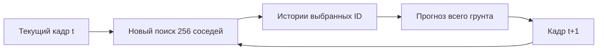

# Динамическое соседство и обработка графа

В текущем ParticleNet соседство **уже динамическое**. Для очередного кадра
выбираются 256 ближайших других маркеров по их текущим координатам.
После движения частиц набор связей может измениться.

## Что происходит сейчас

1. `predict_next_frame()` в [rollout.py](../surrogate/particle/rollout.py)
   строит новый `cKDTree(current[:, POS])` один раз на предсказываемый шаг.
2. `nearest_neighbors()` в [neighbors.py](../surrogate/particle/neighbors.py)
   запрашивает соседей всех центров крупными блоками, до проходов нейросети.
   Результат раздаётся пакетам целей. Дерево включает грунт,
   плиту и стенки; сама частица исключается по номеру строки.
3. По выбранным сейчас ID собираются истории этих же частиц за девять кадров.
   Поиск соседей не повторяется независимо для каждого прошлого кадра:
   иначе история одного соседа могла бы превратиться в последовательность
   разных частиц.
4. Все цели читают одно состояние кадра. После прогноза всего грунта история
   сдвигается и на следующем шаге поиск строится по новым положениям.

На первом шаге есть истинная начальная история. Затем положения грунта
для поиска берутся из собственных прогнозов. При обычном одношаговом
обучении текущий кадр и история берутся из обучающих данных; при replay —
из сохранённой собственной траектории. Фиксированного списка соседей
на весь прогон или файла с заранее записанными связями нет.

## Что означает «граф»

Граф описывает, кто с кем связан: частицы — узлы, связь «сосед j передаёт
информацию центру i» — ребро. В этом смысле наш набор KNN-соседей уже задаёт
направленный динамический граф. Близость j к i не гарантирует обратную
связь: i может не попасть в 256 ближайших для j.

`cKDTree` — пространственная структура для быстрого поиска таких связей.
Граф — результат выбора связей, а не альтернативный способ вычислить
геометрические расстояния. Можно хранить те же связи общим списком рёбер
вместо таблицы соседей каждого центра; это само по себе не изменит модель.

## Чем это отличается от прежней GNS

| Свойство | Текущий ParticleNet | Прежняя GNS |
|---|---|---|
| Выбор связей | 256 ближайших по текущим координатам | Геометрический радиус |
| Изменение связей при движении | Да | Да |
| История | 8 предыдущих кадров + текущий, GRU | Другая схема признаков, без этой GRU-истории |
| Обработка взаимодействий | Сообщение каждой пары, среднее и максимум у центра | Несколько раундов обновления узлов и рёбер |
| Передача через соседа соседа внутри одного прогноза | Нет отдельных раундов | Есть при нескольких слоях message passing |

В текущем [model.py](../surrogate/particle/model.py) одна общая сеть
обрабатывает истории центра и соседей, вычисляет сообщения пар,
объединяет их и выдаёт 16 изменений центра. Все её блоки обучаются совместно.

Таким образом, динамичность связей и количество раундов обмена — две
отдельные настройки архитектуры. Поиск по числу переходов в уже построенном
графе — ещё один отдельный вариант; сейчас расстояние измеряется в метрах.

## Может ли граф ускорить расчёт

Потенциальная переработка: сначала один раз закодировать историю каждого
узла, затем вычислять сообщения по рёбрам с относительными признаками.
Это позволило бы повторно использовать представления узлов. Но в нынешней
сети относительная геометрия пары входит **до GRU** в `neighbor_encoder`.
Поэтому представление соседа зависит от того, для какого центра он взят,
и готовый результат нельзя просто перенести другому центру.

Разделение кодирования узлов и рёбер было бы новой архитектурой и требовало
бы обучения и сравнения. Несколько раундов обмена также добавляют вычисления.
Ускорение не следует из одного названия «динамический граф».

Сначала нужен CUDA-профиль через `rollout --profile`: сколько времени
занимают построение дерева, поиск, сбор историй, переносы и сама сеть.
Замер 4,2–4,4 обновления/с относится к обучению большой сети на 32 целях;
он не измеряет скорость полного кадра. Качество и время нового варианта
графовой обработки в текущем эксперименте ещё не проверены.

Добавлена оптимизация существующего точного KNN: блоки по 4096 целей,
векторное исключение самой частицы и несколько потоков CPU. Граф остаётся
тем же, на следующий кадр списки не переносятся. Для запуска обученной
модели, замера выигрыша и разбора найденного GPU-поиска Chrono см.
[проверку модели](PARTICLE_MODEL_EVALUATION_RU.md).
