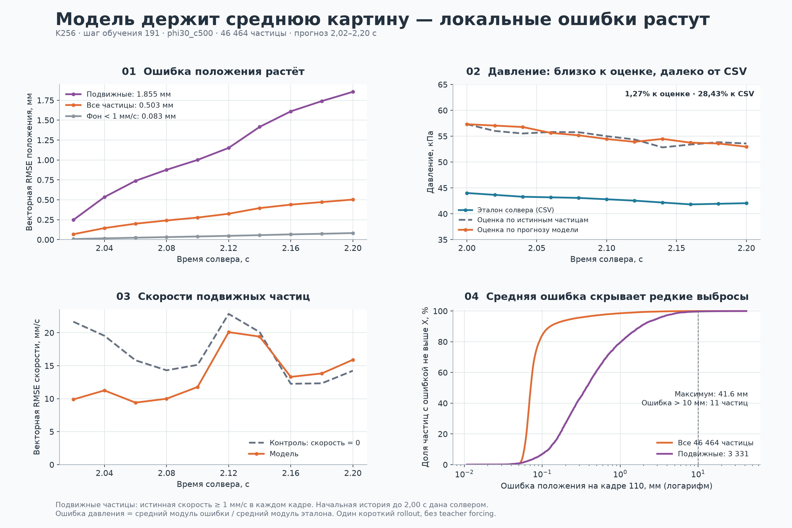
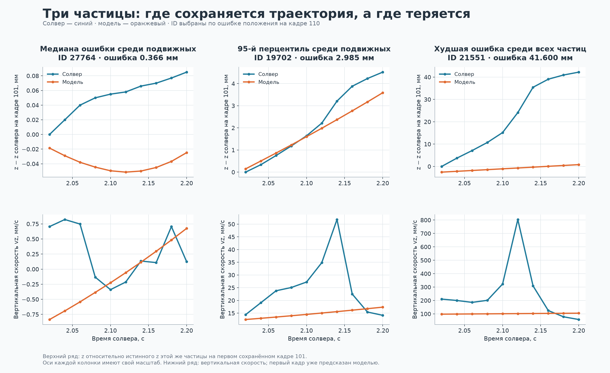
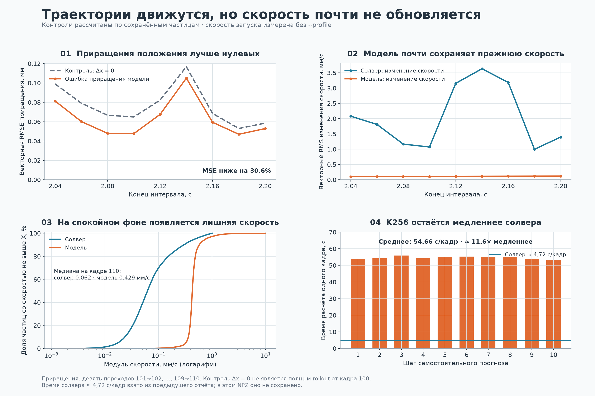
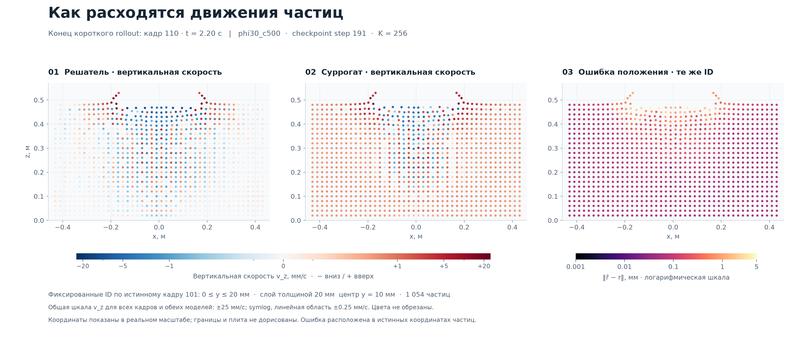

# Проверка суррогата: K256, шаг 191

**Прогноз воспроизводит часть движения, но пока недостаточно точно обновляет скорости и напряжения. Малый общий RMSE скрывает ошибки активных частиц.**

[Открыть все графики в браузере](index.html) · [Анимация](motion.gif)



## Конечный кадр 110

| Показатель | Значение |
|---|---:|
| RMSE положения, все частицы | 0.503 мм |
| RMSE положения, подвижные | 1.855 мм |
| 95-й / 99-й перцентиль ошибки положения | 0.250 / 1.421 мм |
| Максимальная ошибка положения | 41.60 мм |
| Частиц с ошибкой больше 10 мм | 11 |
| RMSE скорости модели / контроль v = 0 | 4.287 / 3.817 мм/с |
| Медиана скорости спокойного фона, модель / солвер | 0,429 / 0,062 мм/с |

## Что именно проверяем

Это прежняя модель K256, checkpoint 191, материал phi30_c500. В файле 46 464 частицы и 10 предсказанных кадров: 101–110, время 2,02–2,20 с. Сеть получила истинную историю до кадра 100 (2,00 с), затем использовала собственный прогноз грунта. Известное движение границ продолжает задаваться извне.

Таким образом, проверено только 0,20 с самостоятельного прогноза: первые две секунды модель здесь не моделировала. По присланному журналу завершено 191 из 3927 обновлений — 4,86% первой эпохи; это ещё ранний результат. Нового K32 в этом архиве нет.


## 0,503 мм в среднем скрывают редкие большие ошибки

В конце окна векторная RMSE положения всех частиц равна 0.503 мм. Для подвижных частиц она уже 1.855 мм. Подвижность определена только по истинной скорости: не меньше 1 мм/с в рассматриваемом кадре. 92.59% всех пар «частица–кадр» не достигают этого порога. Усреднение по всем частицам уменьшает видимую величину ошибки активной области; при этом именно подвижные частицы дают около 98% суммы квадратов ошибок положения на всём окне.

У половины частиц конечная ошибка не больше 0.071 мм, у 95% — 0.250 мм, у 99% — 1.421 мм. Но максимум составляет 41.60 мм; 11 частиц превышают 10 мм. Строка терминала «10/10 до порога 10 мм» относится к общей RMSE, а не к каждой частице.

Худшая частица — ID 21551. Между кадрами 101 и 110 её истинный z вырос на 42,20 мм, предсказанный — на 3,35 мм. Здесь большая ошибка отражает пропущенное быстрое движение эталона; она сама по себе не означает, что модель разбрасывает весь грунт. Три примера на графиках выбраны по явному правилу: медиана и 95-й перцентиль ошибки среди подвижных частиц, затем максимум среди всех.




## Модель слабо обновляет скорость

Прогноз не равен нулевому движению. На девяти доступных переходах 101→102, …, 109→110 ошибка приращений положения по MSE на 30,59% ниже контроля Δx = 0. Но это диагностика изменений между кадрами, а не доказательство превосходства полного rollout над частицами, замороженными в момент старта.

RMS собственных изменений скорости модели — 0.111 мм/с за переход, у солвера — 2.270 мм/с. Модель почти переносит скорость из предыдущего кадра. Ошибка изменения скорости по MSE на 0.51% хуже контроля Δv = 0.

На последнем кадре RMSE скорости всех частиц — 4.287 мм/с. Простой прогноз v = 0 даёт 3.817 мм/с: MSE модели выше на 26.15%. Для подвижной области результат тоже хуже нулевой скорости: 15,900 против 14,239 мм/с. Это относится к концу окна; в среднем по всем десяти кадрам модель ещё лучше этого простого контроля.

Появляется и лишняя скорость на спокойном фоне. Среди частиц с истинной скоростью меньше 1 мм/с на кадре 110 медиана модуля скорости равна 0,062 мм/с у солвера и 0,429 мм/с у модели. На пространственном срезе этот дрейф виден как положительный фон вертикальной скорости. Причину по одному rollout установить нельзя; проверка на истинной истории поможет отделить локальную ошибку от накопления ошибок.






## Давление: 1,27% к оценке, 28,43% к кривой солвера

p_pred и p_gt вычислены одной приближённой формулой: минус среднее напряжение p33 частиц в диске радиуса 0,15 м и слое толщиной 0,04 м под плитой. В первом случае используются предсказанные частицы, во втором — истинные. p_reference — отдельная кривая давления из CSV солвера. Она не является лабораторным измерением.

Ошибка модели относительно оценки по истинным частицам — 1,272%, или 0,695 кПа MAE. Относительно сохранённой кривой солвера — 28,430%, или 12,126 кПа MAE. При этом сама формула на истинном грунте отличается от кривой на 28,047%. Даже до первого прогноза, в кадре 100, оценка равна 57,320 кПа, а CSV — 44,018 кПа.

Поэтому малые 1,27% показывают хорошее совпадение с конкретной оценкой по напряжениям. Они не означают точность итогового давления беваметра 1,27%. Источник расхождения формулы и CSV следует проверять отдельно; исходного CSV, данных плиты и их временного выравнивания в скачанном архиве нет.

Шесть компонент напряжения на последнем кадре имеют RMSE от 0,422 до 1,904 кПа. Однако MSE их приращений на 14.65% хуже контроля «напряжения не меняются». Близость абсолютных напряжений ещё не доказывает правильность динамики. Нулевые ошибки rho, pc, Ev и Sv здесь тривиальны: в эталоне rho = 1600, остальные три поля равны нулю на всём окне.


## За 0,20 секунды процесса потрачено около девяти минут

Все десять шагов заняли 545.8 с вычислений. Основное среднее в CLI исключает первый шаг: 54.66 с/кадр. В архиве нет стадийного профиля: это запуск без --profile. Экспорт NPZ и построение картинки в это время не входят.

При ранее указанном времени солвера около 4,72 с/кадр текущий K256 примерно в 11,6 раза медленнее. Число 4,72 взято из контекста предыдущей проверки, а не из этого NPZ. Новый K32 ещё нужно измерить отдельно. По предыдущему сообщению обучение перед проверкой было остановлено; сам архив модель GPU и фоновую нагрузку не сохраняет.


## Что проверять дальше

1. Сохранить этот результат как контроль K256. Для тех же весов, материала и кадров выполнить teacher forcing: каждый шаг получает истинную историю. Это покажет, насколько ошибки растут именно от использования собственного прогноза.

2. В следующую выгрузку добавить истинное состояние кадра 100. Тогда можно честно сравнить полный rollout с замороженным состоянием и постоянной начальной скоростью от одного и того же старта. Сейчас файл содержит частицы только с кадра 101; подменять начальный кадр нельзя.

3. Новый K32 сравнить на тех же окнах, с тем же горизонтом и шумом. Проверять не только среднюю ошибку: отдельно подвижные частицы, скорости, приращения напряжений, p99/max и давление относительно обеих сохранённых кривых. После короткой проверки нужны более длинные траектории и другие отложенные материалы.

## Методика и файлы

RMSE положения и скорости вычислена по норме трёхмерной ошибки: sqrt(mean(sum(error²))). Начальный истинный кадр исключён. Порог активности задан по солверу отдельно в каждом кадре. Процентили относятся к нормам ошибок частиц, а не к ошибкам отдельных координат.

Все проценты давления в основном отчёте соответствуют CLI: 100 × mean(abs(error)) / mean(abs(reference)). Это не среднее покадровых процентов MAPE. Подробный независимый аудит также содержит MAPE, поэтому его числа немного отличаются.

Срез включает 1054 фиксированных ID, выбранных по истинному кадру 101: 0 ≤ y ≤ 20 мм. Реальный масштаб координат, одинаковая цветовая шкала для истинного и предсказанного vz во всех кадрах. Плита и стенки не дорисованы: их координат в NPZ нет. В анимации темп показа условный; перемещения не усилены.

Новый анализ не запускал нейросеть и не менял веса. Поля проверены на конечность, ID — на уникальность; независимый пересчёт совпал с сохранёнными RMSE. По единственному короткому rollout нельзя доказать устойчивость всей траектории или улучшение относительно другого checkpoint.

- [Метрики основного отчёта](summary_metrics.json)
- [Независимый численный аудит](audit_metrics.json)
- [Показатели по кадрам](per_frame.csv)
- [Ошибки всех 16 полей](features.csv)
- [Три выбранные частицы](selected_particles.csv)

Источник: `checkpoints/preview_k256.npz`.
SHA-256: `de0469c7f6ef88e54631ddcdeb5081a36ca25f2d6f9aed619cab3b5781b4002d`.

Воспроизведение из корня проекта:

```bash
.venv/bin/python output/preview_k256_step191/audit_metrics.py
MPLCONFIGDIR=/tmp/sph-preview-mpl .venv/bin/python output/preview_k256_step191/analysis.py
MPLCONFIGDIR=/tmp/sph-preview-mpl .venv/bin/python output/preview_k256_step191/spatial_analysis.py
.venv/bin/python output/preview_k256_step191/build_report.py
```
